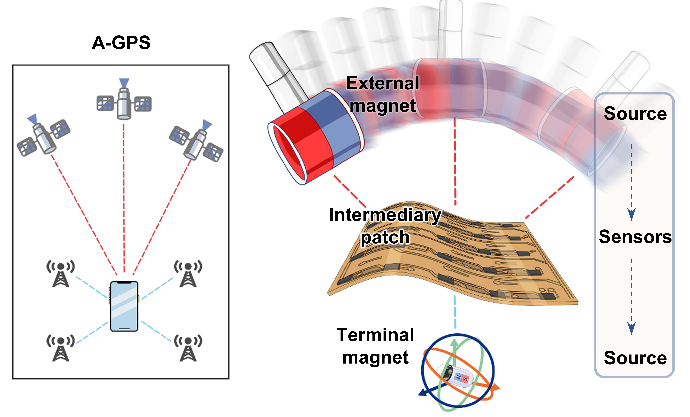
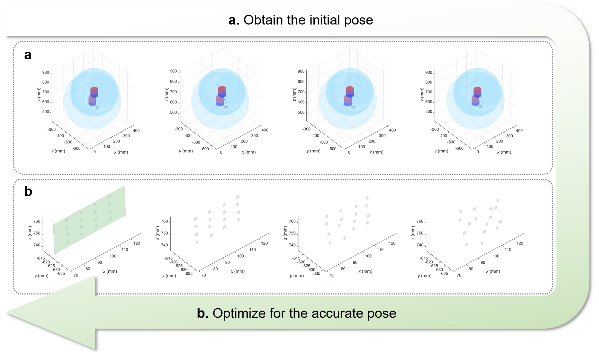

# Dual-stage-magnetic-localization

This repository provides the implementation of the dual-stage magnetic localization algorithm for the flexible intermediary patch. It includes examples of the first stage, where the external magnetic source is used to localize the patch, and the second stage, where the sensor array is used to localize the internal magnetic source. All functions and scripts are primarily written in MATLAB.

<div align=center>
  
</div>

<div align=center>
The concept of dual-stage magnetic localization inspired from A-GPS
</div>

## Prerequisites
- **Matlab R2023a**
  - **elfun18** for elliptic integral. 
    - milan batista (2025). elfun18 (https://www.mathworks.com/matlabcentral/fileexchange/65915-elfun18)
  - **Optimization Toolbox** for optimization,
- **Python 3.8**
  - **urx** for UR control
    - ```pip install urx==0.9.0```

## Directory Overview
- `UI/`
  Contains human–machine interaction interfaces developed using MATLAB App Designer for magnetometer data acquisition, robotic arm control, and motion capture integration.
- `Functions/` Includes functions and scripts used to implement the dual-stage magnetic localization algorithm.
  - `magnetic_field_functions/` Provides functions for computing the magnetic field based on a complete elliptic integral model, along with its analytical Jacobian matrix.
  - `Python/` Python scripts used for BLE data reception and robotic arm control.
  - `UR_planning/` Motion planning files for multi-robot arm coordination.
  - `classdef/` Class definitions used in the MATLAB UI applications.

-  `First phase/First_phase.m` A simple example of the first-phase localization, demonstrating sensor localization via micro-displacement of an external magnetic source. The provided scripts are structured in executable sections, allowing users to run them step by step and inspect the corresponding results. (Supplementary Video 1)
<div align=center>
  
</div>
<div align=center>
The optimization of phase 1 （include obtaining the initial value）
</div>

-  `Second phase/Second_phase.m` A basic implement of the second-phase localization, in which the internal magnetic source is localized based on the estimated sensor. And the analytical Jacobian significantly increases the optimization efficiency, ensuring realtime tracking.
<div align=center>
  
</div>
<div align=center>
The optimization of phase 2
</div>